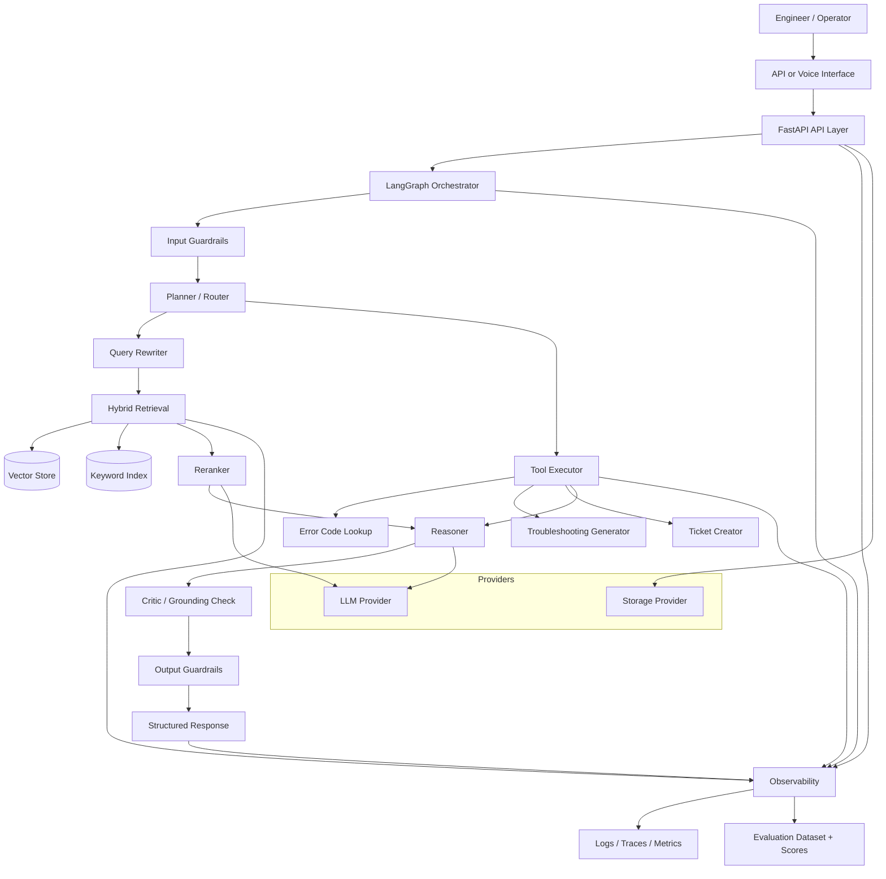
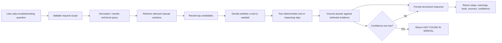

# Agentic RAG Troubleshooting Copilot

Production-oriented, local-first GenAI copilot for healthcare device troubleshooting. The system is designed to answer operational questions from manuals and procedures, execute deterministic troubleshooting workflows, and stay portable from a local development stack to AWS without rewriting the business layer.

This repository is intentionally structured as an engineering foundation, not a chatbot demo. The emphasis is on retrieval quality, deterministic orchestration, observability, evaluation, and clean provider boundaries.

## Why This Project Exists

Field support and service teams often work with fragmented troubleshooting manuals, error code references, and service procedures. A useful copilot in this environment must do more than generate fluent text:

- retrieve the right evidence from the right document section
- reason through a deterministic workflow
- invoke structured tools when needed
- refuse unsupported or unsafe requests
- expose logs, metrics, and evaluation artifacts for inspection

The target outcome is a grounded troubleshooting assistant that behaves like an auditable system, not a black-box assistant.

## What "Production-Oriented" Means Here

- Deterministic orchestration over free-form autonomous behavior
- Hybrid retrieval with reranking instead of naive vector-only search
- Provider abstractions so local development and AWS deployment share the same core logic
- Structured outputs with explicit sources and confidence
- Guardrails for scope restriction, prompt injection resistance, and low-confidence handling
- First-class observability and evaluation from the start

## Scope

### In scope

- Healthcare device troubleshooting guidance
- Manual and procedure-grounded question answering
- Error code lookup and procedural assistance
- Tool-assisted workflows such as ticket creation or structured lookups
- Voice-friendly interaction patterns for field usage

### Out of scope

- Medical diagnosis
- Clinical decision support
- Ungrounded answers without retrieved evidence
- Vendor-specific lock-in inside the business layer

## System Principles

The project follows a few non-negotiable design principles:

1. System design matters more than a single model call.
2. Retrieval quality is the primary accuracy lever.
3. Workflows should be explicit, testable, and traceable.
4. Every meaningful capability should be measurable.
5. Local-first development should map cleanly to cloud deployment.

## Architecture

The application is organized as a layered system with clear seams between orchestration, retrieval, provider integrations, and operational concerns.



## User Flow

The user experience is designed around a grounded troubleshooting path rather than open-ended chat.



## Request Lifecycle

1. A user submits a troubleshooting question through the API or voice interface.
2. Input guardrails validate domain fit, reject disallowed requests, and sanitize the prompt.
3. The orchestrator routes the request through a deterministic graph.
4. The retrieval system rewrites the query, performs hybrid search, and reranks the results.
5. The workflow decides whether tool execution is required.
6. The reasoning layer produces a grounded response using retrieved context and tool outputs.
7. Output guardrails verify grounding, confidence, and response structure.
8. Observability captures logs, traces, latency, retrieval context, and evaluation signals.

## Repository Layout

The codebase is scaffolded to keep concerns separate from day one.

```text
app/
  api/             # FastAPI routes, request/response contracts, transport concerns
  core/            # Shared config, types, domain models, utilities, guardrails
  agents/          # LangGraph nodes, state definitions, orchestration workflows
  retrieval/       # Chunking, embedding, BM25, hybrid fusion, reranking
  providers/       # LLM, vector store, storage, speech, and cloud/local adapters
  tools/           # Deterministic tools and action executors
  eval/            # Offline evaluation pipelines, datasets, scoring
  observability/   # Logging, tracing, metrics, telemetry exporters

data/              # Manuals, evaluation sets, fixtures, ingestion outputs
scripts/           # CLI utilities for ingestion, indexing, evaluation, setup
docs/              # Deep-dive architecture, ops notes, and future ADRs
```

## Tech Stack

The design goal is local development without sacrificing a clean production path to AWS.

| Concern | Local-first stack | AWS-aligned stack | Why this split works |
| --- | --- | --- | --- |
| API layer | FastAPI | FastAPI on Lambda or ECS | Keep transport contracts identical across environments |
| Workflow orchestration | LangGraph | LangGraph | Deterministic graph logic remains unchanged |
| LLM provider | Ollama | Amazon Bedrock | Provider abstraction isolates model vendor concerns |
| Embeddings | Local embedding model via Ollama or sentence-transformers | Bedrock embeddings or managed embedding endpoint | Swap implementation, not calling code |
| Vector retrieval | Chroma | OpenSearch | Same retrieval contract, different backing store |
| Keyword retrieval | Local BM25 / Whoosh-style index | OpenSearch BM25 | Hybrid retrieval remains consistent |
| Reranking | Local cross-encoder or lightweight reranker | Bedrock-compatible reranker or hosted rerank service | Accuracy improvements without changing workflow shape |
| Storage | Local filesystem | Amazon S3 | Ingestion and artifact storage map cleanly |
| Speech input/output | Local STT/TTS providers | Amazon Transcribe / Polly | Voice remains optional and replaceable |
| Observability | Structured JSON logs, OpenTelemetry, local dashboards | CloudWatch, X-Ray, OpenTelemetry collectors | Same telemetry model, different sink |
| Evaluation | Local scripts and notebooks | Scheduled evaluation jobs and persisted score history | Quality measurement works in both environments |
| Deployment | Local Python runtime, Docker | Lambda or ECS with managed AWS dependencies | Keeps infra choices flexible by workload |

## Local vs AWS Provider Mapping

| Capability | Local implementation | AWS implementation |
| --- | --- | --- |
| LLM | Ollama | Bedrock |
| Vector store | Chroma | OpenSearch |
| Keyword search | Local BM25 | OpenSearch |
| Object storage | Filesystem | S3 |
| API hosting | Local process / Docker | Lambda or ECS |
| Tracing and metrics | OpenTelemetry + local sink | CloudWatch + X-Ray + OpenTelemetry |
| Voice | Local provider | Transcribe + Polly |

## Core Design Decisions

The README is based on the architecture intent in [agent.md](./agent.md) and the decision log in [decisions.md](./decisions.md). The most important decisions are:

- Use RAG instead of fine-tuning in the initial phase because manuals are dynamic and must stay updateable.
- Prefer deterministic workflow orchestration over open-ended autonomous agents for traceability and debugging.
- Invest in hybrid retrieval plus reranking because this use case depends on both semantic relevance and exact terminology.
- Keep provider boundaries explicit so local experimentation and AWS deployment do not fork the core design.
- Treat observability, guardrails, and evaluation as core product features rather than post-demo additions.

## Retrieval Strategy

This is not intended to be a simple "embed and search" system. The retrieval layer is expected to include:

- section-aware chunking aligned to manual structure, procedures, and error code groupings
- chunk sizes in the roughly 300 to 800 token range with modest overlap
- hybrid retrieval across dense and sparse indexes
- weighted result fusion before reranking
- reranking from a broader candidate set to a narrow grounded context window
- query normalization and rewriting for technical terms, abbreviations, and error strings

## Agent Workflow Design

The orchestration layer should be implemented as pure, testable graph nodes with explicit state transitions.

Expected node responsibilities:

- `planner`: classify the request and determine the path
- `retriever`: fetch the best supporting context
- `reasoner`: synthesize an answer from context and tool outputs
- `tool_executor`: run deterministic actions
- `critic`: check grounding, completeness, and confidence
- `human_approval`: optional approval step for sensitive actions

The design intent is to minimize hidden state and make failures debuggable.

## Response Contract

Responses should be consistent and operationally useful. The target output shape is:

```text
Steps:
Warnings:
Tools:
Sources:
Confidence:
```

If the system cannot support a conclusion from retrieved material, it should say so explicitly rather than improvise. Low-confidence responses should degrade gracefully to `NOT FOUND IN MANUAL`.

## Guardrails

Guardrails are a first-class requirement because the assistant operates in a sensitive domain.

### Input guardrails

- detect prompt injection attempts
- reject requests outside supported troubleshooting scope
- sanitize inputs before orchestration
- prevent use as a medical diagnosis assistant

### Output guardrails

- require grounding in retrieved evidence
- block unsupported troubleshooting steps
- return explicit low-confidence outcomes when evidence is weak
- preserve source attribution and confidence visibility

## Observability

Every meaningful request should be traceable. At minimum, telemetry should capture:

- request identifier
- original and rewritten query
- retrieved documents and ranking metadata
- prompts and provider calls
- tool invocations and results
- response payload
- latency and token usage
- confidence and evaluation signals

The goal is to make failures diagnosable and improvement work measurable.

## Evaluation

The project should maintain a standing evaluation set rather than relying on anecdotal manual testing.

Planned evaluation focus:

- faithfulness
- answer relevance
- context precision
- retrieval hit quality
- tool execution success rate
- latency by workflow path

The baseline expectation is a representative dataset with edge cases, ambiguous phrasing, exact error codes, and incomplete-context scenarios.

## Non-Functional Requirements

### Reliability

- deterministic workflow paths
- graceful fallback behavior
- explicit failure states

### Maintainability

- provider abstraction boundaries
- modular folder ownership
- typed interfaces and structured logging

### Portability

- no vendor-specific logic in domain modules
- environment-driven configuration
- replaceable storage, model, and retrieval adapters

### Performance

- cache embeddings where possible
- avoid unnecessary model invocations
- keep retrieval candidate sets bounded
- measure latency at each stage of the graph

## Project Status

The repository currently contains the architecture scaffold and decision baseline. The folder layout is in place, and the next implementation phases are expected to focus on:

1. provider interfaces and configuration models
2. ingestion, chunking, and indexing pipelines
3. LangGraph workflow nodes and state contracts
4. API endpoints and structured response schemas
5. evaluation harness and observability integration

This status is intentional: the repo is being shaped around a durable system architecture before feature sprawl begins.

## Known Limitations

- no real-time device integration yet
- no clinical validation
- local model quality will vary by hardware and model choice
- retrieval quality depends heavily on document quality and chunking discipline
- voice features add operational complexity and latency

## Reference Documents

- Architecture intent: [agent.md](./agent.md)
- Architectural decisions: [decisions.md](./decisions.md)

## Standard

The bar for this project is simple: build it the way you would if it needed to survive its first production incident.
